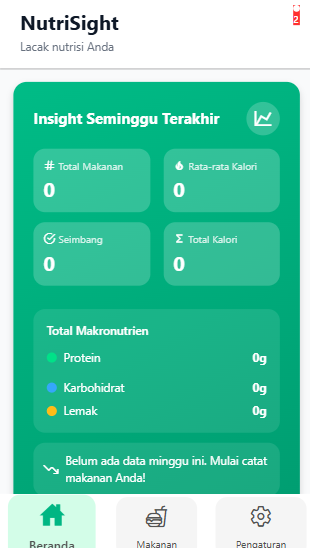

# NutriSight — Pelacak Nutrisi AI untuk Semua Usia 🥗

## Problem
Orang tahu mereka harus makan bergizi, tapi terlalu ribet untuk mencatat. Aplikasi yang ada butuh koneksi stabil, database makanan Indonesia-nya tipis, dan antarmukanya dirancang untuk atlet — bukan orang biasa.

## Solution
Aplikasi mobile yang membuat pencatatan nutrisi semudah foto selfie:
- **Foto makanan → AI hitung kalori, protein, karbo, lemak** — tidak perlu cari nama makanan
- **Offline-first**: semua aksi langsung tercatat meskipun tidak ada sinyal — sync ke cloud terjadi otomatis di background
- Katalog menu Indonesia lokal yang nutrisinya dihitung dari resep asli, bukan estimasi asal
- Ringkasan mingguan otomatis dari AI — tanpa perlu baca grafik sendiri
- Dirancang untuk semua usia: anak-anak, remaja, dewasa, lansia, ibu hamil

## Result
- Tracking nutrisi harian tanpa hambatan — tidak ada spinner, tidak ada error jaringan
- Data tetap aman meskipun tiba-tiba tidak ada sinyal di tengah jalan
- Pengguna lebih sadar pola makan tanpa harus jadi ahli gizi

## Demo
(screenshot halaman scan foto + beranda statistik + riwayat harian)
> 

> 

> 
## Use Cases
- Keluarga yang ingin memantau asupan gizi sehari-hari
- Ibu hamil dan lansia dengan kebutuhan nutrisi khusus
- Siapa saja yang mau lebih sadar makan tapi tidak mau repot

## Tech
React Native, Expo, TypeScript, Appwrite, OpenRouter (GPT-4o), NativeWind
